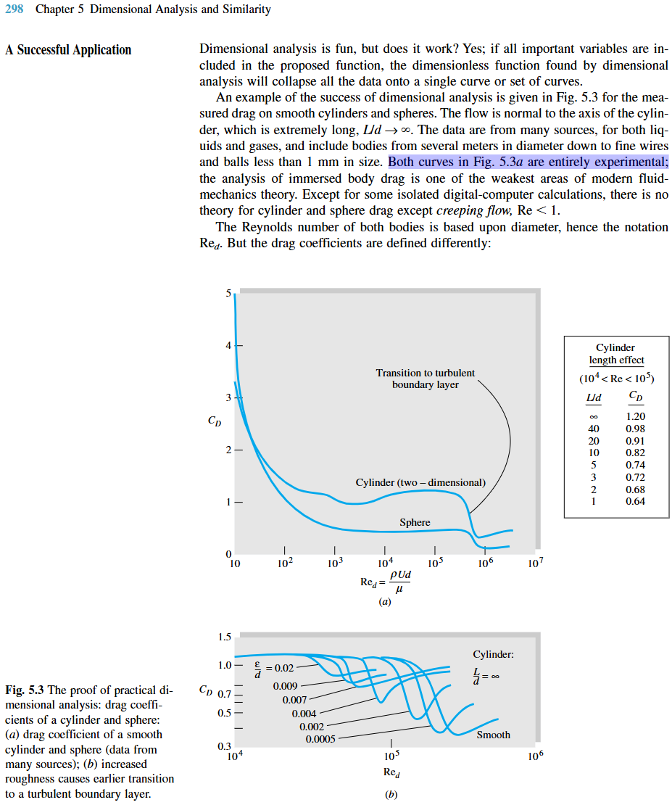
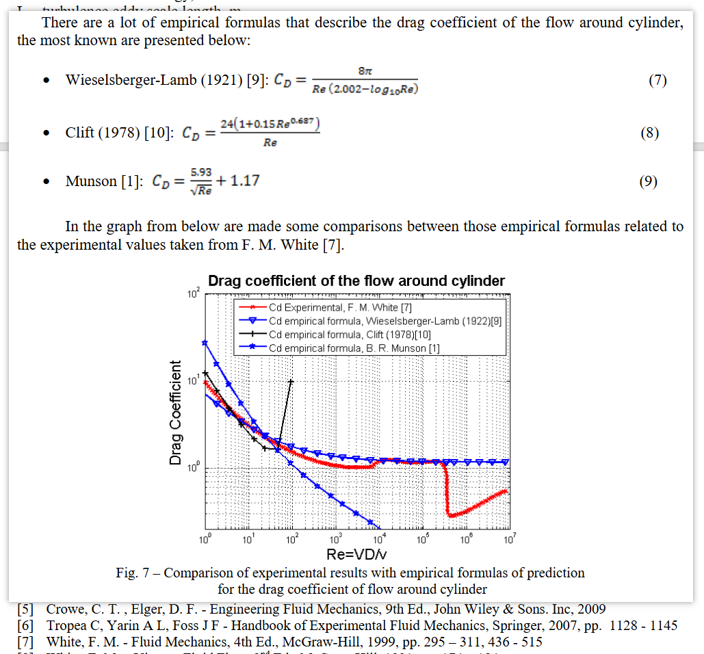

## how to get Cd experimental data of flow past cylinder

In Fluid Mechanics 4th Frank M. White,  measured drag on smooth cylinders and spheres are presented.

How can I get the original data from the book?

I can see some paper plot the same figure and refered to this book. How can they do that?

Computational analysis of the flow around a cylinder and of the drag force

[https://www.researchgate.net/publication/274309261_Computational_analysis_of_the_flow_around_a_cylinder_and_of_the_drag_force](https://www.researchgate.net/publication/274309261_Computational_analysis_of_the_flow_around_a_cylinder_and_of_the_drag_force)

Finally I know that we can use software, such as `getdata`.